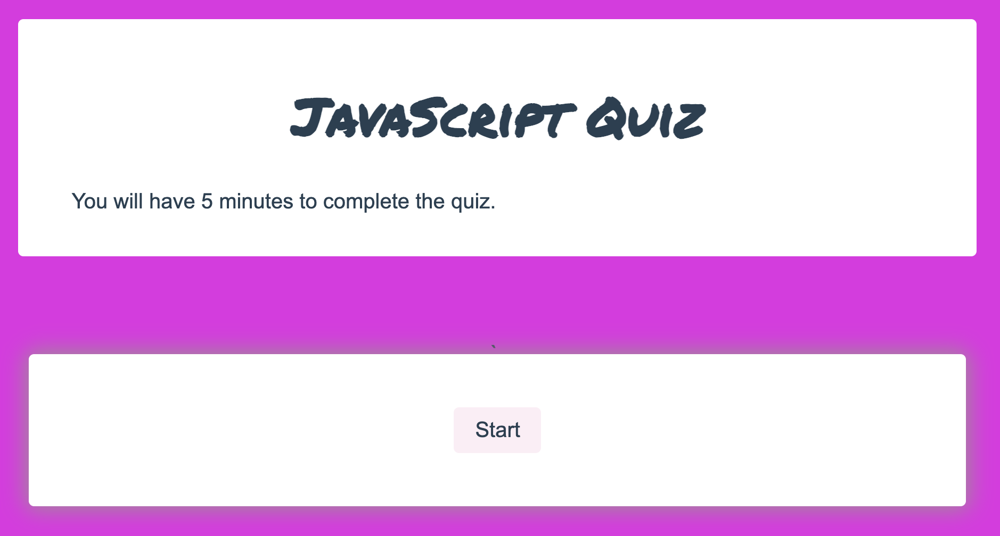

# Code_Quiz
This is a short, timed quiz to test your JavaScript knowledge!

This quiz gives you 5 minutes to move through the questions and will display your results at the end. If time runs out, it will automatically display your results and give you the option to re-start the quiz.

## User Story

```
AS A student
I WANT to take a timed quiz on JavaScript fundamentals 
SO THAT I can reinforce key ideas to ensure understanding
```

You are able to see the deployed application [here](https://lvgraham.github.io/Code_Quiz/). 



